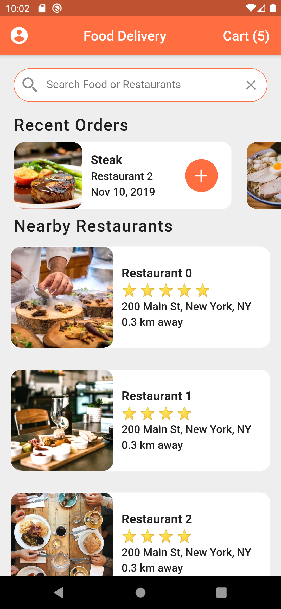
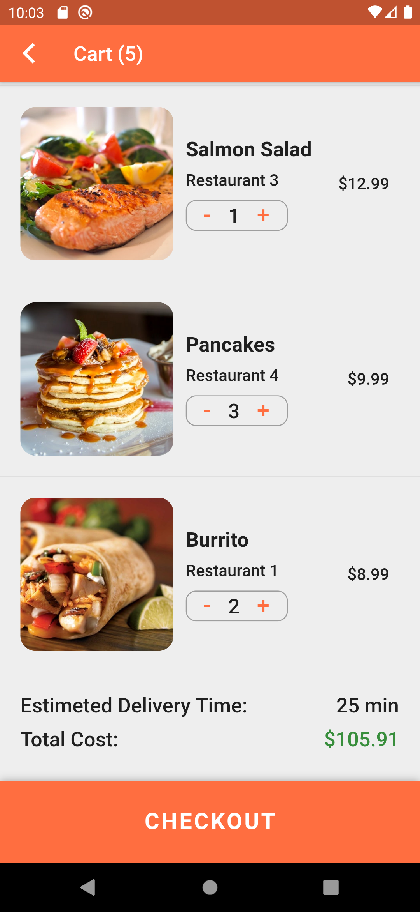

# Food Delivery APP UI
Flutter UI Practice, Food Delivery App UI  
<<<<<<< HEAD

UI inpired from Marcus NG

<!--  -->

Home Screen

Restaurant Screen

Cart Screen

<!--  -->
<!--  -->

=======

UI inpired from Marcus NG

>>>>>>> e55e91d68caa0b95037b5892824b0d8135e22aa7
